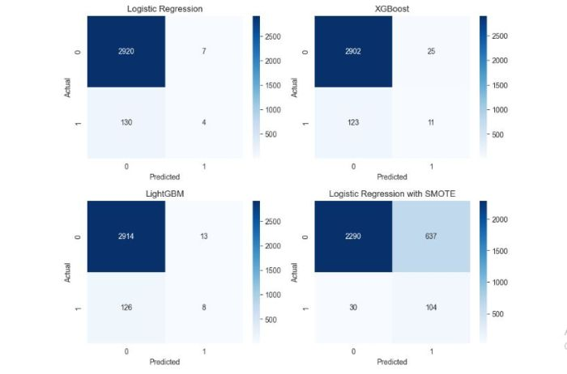

<h1>Stroke Prediction Web App</h1>

<h3>Advanced Classification Techniques and Concepts: Voting Classifier, Pipelines, AUC-ROC curves</h3>

You can view the live demo [here](https://oyebamiji-micheal-stroke-prediction-web-app.streamlit.app/)

 

<h2>Table of Contents</h2>

- [Overview](#overview)
- [Objective](#objective)
- [Dataset](#data)
- [Insights from EDA](#insights)
- [Models and Evaluation Metrics](#model)
- [Model Selection - Conclusion](#conclusion)
- [Resources and References](#reference)

 

<h2>Overview</h2>

Stroke is the 2nd leading cause of death globally, responsible for approximately 11% of total deaths (WHO). Stroke is a medical condition characterized by disrupted blood supply to the brain, leading to cellular death. Signs and symptoms of a stroke may include an inability to move or feel on one side of the body, problems understanding or speaking, dizziness, or loss of vision to one side. 
 
This project aims to predict whether a patient is likely to get a stroke based on input parameters like gender, age, various diseases, smoking status, and so on. 

 

<h2>Objective</h2>

The primary objective of this project is to develop a fairly accurate and robust machine learning model that predicts the occurrence of strokes in individuals. By leveraging advanced techniques such as voting classifiers, pipelines, AUC-ROC curve analysis, and feature engineering, I created a predictive model that can fairly identify individuals at risk of strokes.

 

<h2>Dataset</h2>

The dataset for this project originates from the <a href="https://www.kaggle.com/competitions/playground-series-s3e2/data">Kaggle Playground Series, Season 3, Episode 2</a>. The competition provides a synthetic dataset that was generated from a deep learning model trained on the <a href="https://www.kaggle.com/datasets/fedesoriano/stroke-prediction-dataset">Stroke Prediction Dataset</a>. Key features of the dataset include attributes related to various aspects of an individual's health, demographics, and lifestyle.

 

<h2>Insights From EDA</h2>

The dataset contains about 15303 rows and 12 columns. The CSV file, along with the column description, can be found on <a href="https://www.kaggle.com/competitions/playground-series-s3e2/data">Kaggle</a>. Below are some of the insights gained after performing an EDA. 

- The data contains an imbalanced class distribution. Below is the proportion of people who are stroke positive and people who are not.  
 

The majority of stroke cases occur amongst adults between the ages 45 to 80 as shown below 

- Both classes seem to have roughly the same mean of 29. Also, a fairly large proportion of people who are stroke positive have a BMI of around 27 - 33.  

All other insights including the influence of `gender`, `bmi`, `heart condition`, etc. on `stroke status` can be found in the [notebook](). Kindly note that the data used was deep learning generated. Any inference or conclusion drawn might not reflect a real world instance. 

 

<h2>Models and Evaluation Metrics</h2>

Below is the performance comparison of all models trained in the notebook
<table align="center" border="1" style="border-collapse: collapse;">
  <tr>
    <th>Model</th>
    <th>Accuracy</th>
    <th>Precision</th>
    <th>Recall</th>
    <th>F1 Score</th>
  </tr>
  <tr>
    <td>Logistic Regression with SMOTE</td>
    <td>0.782097</td>
    <td>0.140351</td>
    <td>0.776119</td>
    <td>0.237714</td>
  </tr>
  <tr>
    <td>XGBoost</td>
    <td>0.951650</td>
    <td>0.305556</td>
    <td>0.082090</td>
    <td>0.129412</td>
  </tr>
  <tr>
    <td>LightGBM</td>
    <td>0.954590</td>
    <td>0.380952</td>
    <td>0.059701</td>
    <td>0.103226</td>
  </tr>
  <tr>
    <td>VC Soft</td>
    <td>0.954917</td>
    <td>0.357143</td>
    <td>0.037313</td>
    <td>0.067568</td>
  </tr>
  <tr>
    <td>Logistic Regression</td>
    <td>0.955243</td>
    <td>0.363636</td>
    <td>0.029851</td>
    <td>0.055172</td>
  </tr>
  <tr>
    <td>Random Forest</td>
    <td>0.952957</td>
    <td>0.222222</td>
    <td>0.029851</td>
    <td>0.052632</td>
  </tr>
  <tr>
    <td>VC Hard</td>
    <td>0.955897</td>
    <td>0.400000</td>
    <td>0.014925</td>
    <td>0.028777</td>
  </tr>
</table>

 

<h2>Model Selection and Conclusion</h2>

In this instance, a higher number of FN means the model fails to identify someone as having a stroke when they actually did have a stroke while FP means the model incorrectly identifies someone as having a stroke when they did not actually have a stroke. Choosing precision as my primary evaluation metric means that I want to avoid FP as much as possible and choosing recall means I want to avoid FN as much as possible. I have considered False Negatives as more costly and potentially dangerous for this task. Hence, recall is chosen as the evaluation metric.

The logistic regression model with SMOTE sampling seemed to be a good model in terms of our chosen metric - less False Negatives. However, this is achieved at the expense of precision. The image below shows the point where we have to start trading a lot of Precision for a better Recall score!

 

<h2>Resources and References</h2>

- <a href="https://en.wikipedia.org/wiki/Stroke">Stroke - Wikipedia</a>
  
- <a href="https://www.kaggle.com/code/marcinrutecki/voting-classifier-for-better-results">Voting Classifier for Better Results - MARCIN RUTECKI</a>

- <a href="https://machinelearningmastery.com/random-oversampling-and-undersampling-for-imbalanced-classification/">Random Oversampling and Undersampling for Imbalanced Classification</a>